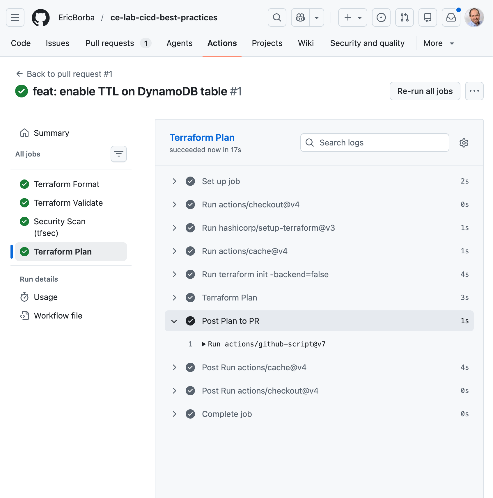
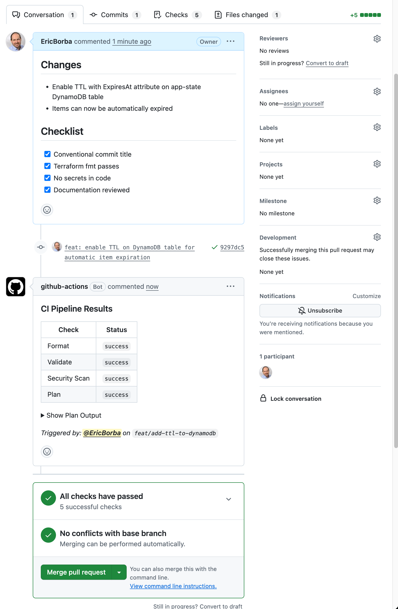
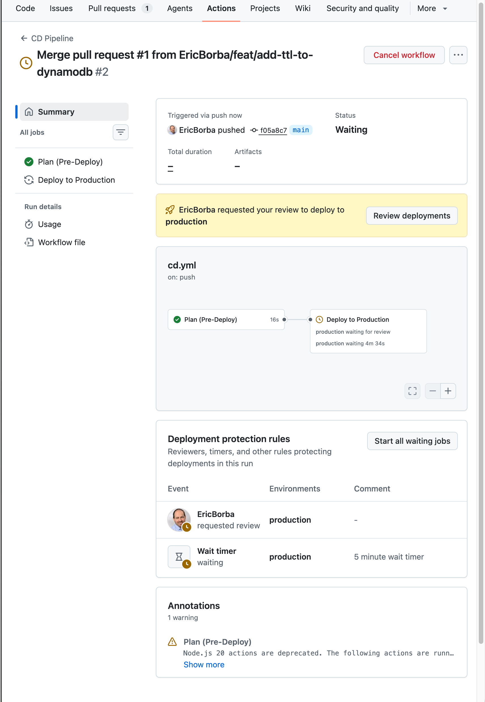
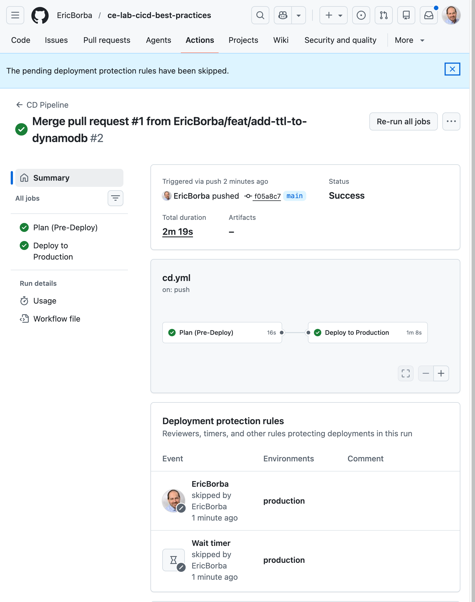
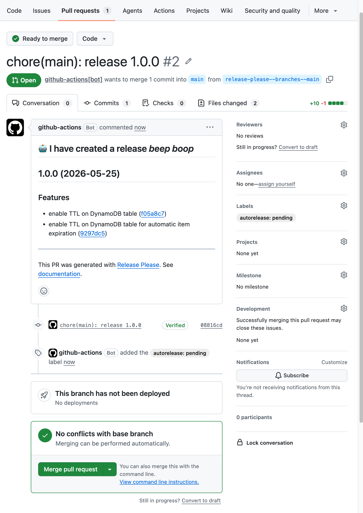
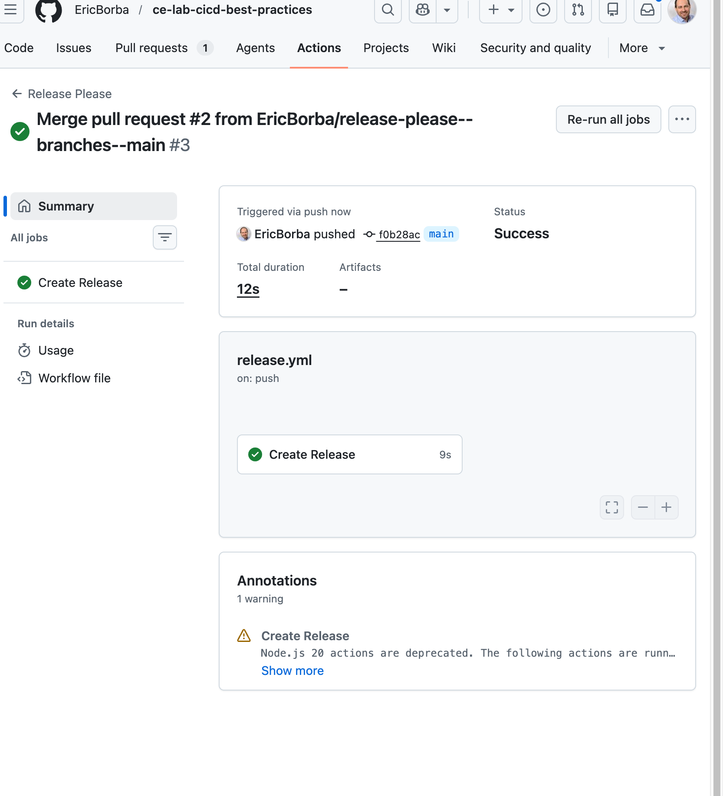
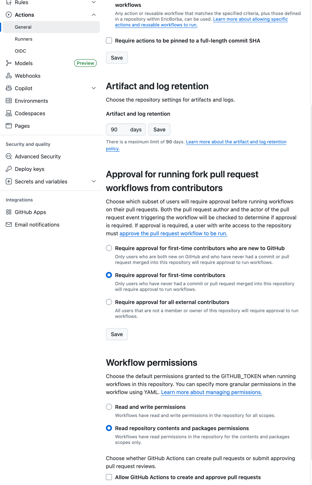

# CI/CD Best Practices — Terraform Infrastructure


## Architecture

This repository manages shared infrastructure resources:

- **S3 Bucket** — Versioned artifact storage with AES256 encryption and lifecycle policies (transitions to STANDARD_IA after 90 days)
- **DynamoDB Table** — Application state store with point-in-time recovery, encryption at rest, and TTL support

## CI/CD Workflows

| Workflow | Trigger | Purpose |
|---|---|---|
| CI Pipeline | PR to `main` | Format check, validate, tfsec security scan, plan |
| CD Pipeline | Push to `main` | Plan + deploy with manual approval gate |
| Commit Lint | PR open/edit | Enforce conventional commit titles |
| Release Please | Push to `main` | Automated semantic versioning and changelog |

### CI Pipeline

Every pull request targeting `main` runs four parallel jobs:

1. **Terraform Format** — `terraform fmt -check -recursive -diff`
2. **Terraform Validate** — `terraform validate` with provider cache
3. **Security Scan (tfsec)** — static analysis for misconfigurations (soft fail)
4. **Terraform Plan** — runs after all three pass; posts results as a PR comment



The plan output is automatically posted as a comment on the PR so reviewers can see exactly what will change before approving.



### CD Pipeline

Merges to `main` that touch `terraform/**` trigger the CD pipeline:

1. **Plan (Pre-Deploy)** — runs `terraform plan` and saves the plan artifact
2. **Deploy to Production** — pauses and waits for manual approval in the `production` GitHub environment before running `terraform apply`





### Release Please

When a PR with a conventional commit title is merged, `release-please` opens a Release PR that bumps `version.txt` and updates `CHANGELOG.md`. Merging the Release PR creates a GitHub Release with a version tag.





## Quick Start

```bash
cd terraform
terraform init
terraform plan
terraform apply
```

## Required GitHub Secrets

| Secret | Description |
|---|---|
| `AWS_ACCESS_KEY_ID` | IAM user access key with permissions to manage S3 and DynamoDB |
| `AWS_SECRET_ACCESS_KEY` | Corresponding IAM secret key |

## Required GitHub Environment

The CD workflow uses a `production` environment with **Required reviewers** enabled. Set it up at **Settings → Environments → New environment** and add yourself as a required reviewer.



## Contributing

See [CONTRIBUTING.md](CONTRIBUTING.md) for commit conventions, PR process, and CI/CD guidelines.
